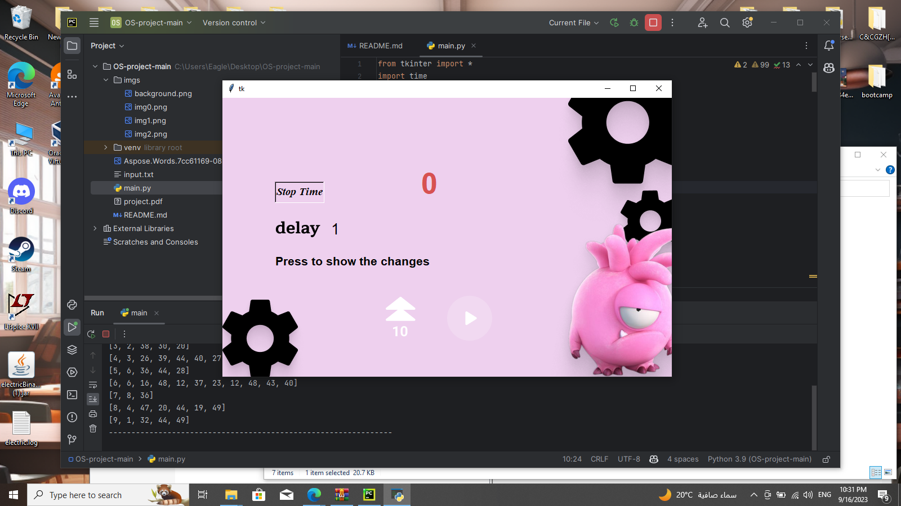

Electrical and Computer Engineering Department Operating Systems ‐ ENCS3390 

Project – Simulating Multilevel Feedback Queue Scheduling Submission deadline: 10.2.2023 

In this project you will simulate a multilevel feedback queue scheduling algorithm and report some performance measures on randomly generated workloads.  

***This assignment is for groups of 2 students.*** 

The project consists of two parts: workload generator, and the simulator. The requirements for each part are as follows: 

1. **Workload Generator** 

This part generates a random workload and saves it to a file. The output file should have the following structure  

Each line in the file represents a process with a unique PID. All other numbers should be randomly generated from a range that is specified by the user. The generator should take the following parameters to generate the workload: 

- **Number  of  processes**:  an  integer  value  that  specifies  the  number  of  generated processes. 
- **Max arrival time**: an integer value specifies the maximum arrival time. The arrival time of the processes should be randomly chosen from the interval [0, Max arrival time]. 
- **Max No. of CPU Burst**: an integer value that specifies the max number of CPU bursts for any process. The number of CPU burst for each process should be randomly generated from the range [1, Max No. CPU Burst]. Between the CPU burst you should insert IO bursts. However, note that the first and last bursts in any process must be CPU Burst. 
- **[Min  IO,  Max IO]**:  The  range  for  the  IO  burst duration,  which  should  be  randomly generated. 
- **[Min CPU, Max CPU]**: The range for the CPU burst duration, which should be randomly generated. 

The generated workload should be saved to a file, which can be then used as input for the simulator. 

2. **Simulator** 

The input of the simulator is a file describing a workload. The file should have the structure described in the previous section and can be either randomly generated or given by the user. 

You need to simulate a multilevel feedback queue scheduling algorithm with 4 queues: 

- Queue#1: Round Robin (RR) with time quantum q1. 
- Queue#2: Round Robin (RR) with time quantum q2. 
- Queue#3: Shortest-remaining-time first. 
- Queue#4: FCFS 

The user should be able to specify the value of q1, q2 and  that is used to predict the duration of next CPU burst for the shortest-remaining-time first algorithm. 

A new job enters Queue#1, if it does not finish its CPU burst within 10 time-quanta, it is moved to Queue#2. Any job in Queue#2 should receive at max 10 time-quanta to finish its current CPU burst, if it does not finish, it is moved to Queue#3. 

Jobs in Queue#3 are scheduled using the shortest-remaining-time first algorithm. If a process is preempted 3 times by other process entering Queue#3, it is moved to Queue#4 where it is scheduled using FCFS algorithm.  

Queue#1 is considered the highest priority and Queue#4 is the lowest. The scheduler first executes all processes in Queue#1. Only when Queue#1 is empty will it execute processes in Queue#2. A process that arrives for Queue#2 will preempt a process in Queue#3. A process in Queue#2 will in turn be preempted by a process arriving for Queue#1.  

` `Assume that the context switch time is very small and can be ignored in the simulation. 

When a process finishes its current CPU burst, it moves to IO and starts consuming its IO burst.  Assume  that  processes  do  not  wait  for  each  other  and  they  can  perform  IO simultaneously. When the IO burst is finished, the process goes back to the queue from which it requested the last IO burst (the last queue that the process was assigned to). 

The user should be able to pause the simulation at any time and view the list of processes in each queue, the currently running process, and the processes performing IO. 

At the end of the simulation, you should output the Gantt chart, CPU utilization, and the average waiting time for all the processes. 

